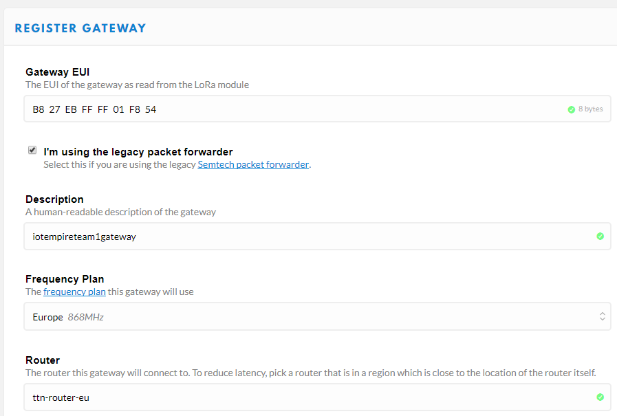
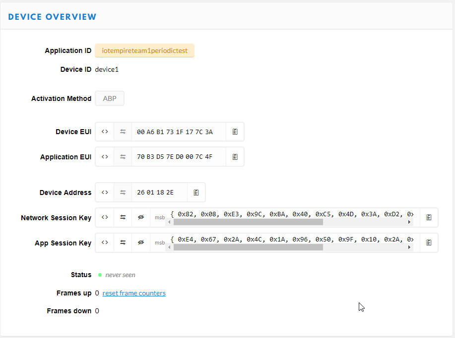
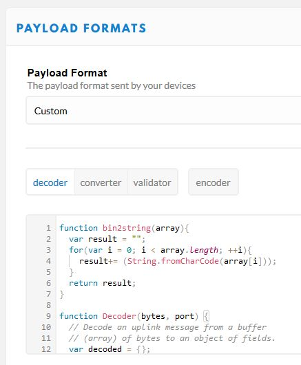

# LoRa and The Things Network

Configure the [Dragino LoRa/GPS Hat](http://wiki.dragino.com/index.php?title=Lora/GPS_HAT) for the Raspberry Pi 3 to use the Raspberry as LoRa Gateway (with connection to *The Things Network*) and as LoRa Device (sender).

## Software
The following software was used:
- **LoRa Gateway:** https://github.com/tftelkamp/single_chan_pkt_fwd
- **LoRa Device:** https://github.com/ernstdevreede/lmic_pi

## Configure the Raspberry as LoRa TTN Gateway
### Preperation
- Use the raspi-config tool (with `sudo raspi-config`) to enable SPI on the Raspberry Pi
- Install wiringpi (`sudo apt-get install wiringpi`)

### Download
- Download and unzip the software for a *Single Channel Gateway*: 
`wget https://github.com/tftelkamp/single_chan_pkt_fwd/archive/master.zip` 
`unzip master.zip`

### Configuration
- The server address which is used by the gateway software must be changed to one of the TheThingsNetwork servers
- Use the nearest TTN server (e.g. 'eu.thethings.network'). The IP address can be resolved using the `nslookup` command.
- Edit the *main.cpp* file and insert the IP address of the server 'eu.thethings.network' (in line 88, into the define **SERVER1**): 
`#define SERVER1 "52.169.76.255"`

- The full source code can be found in [lora_ttn_gw/](lora_ttn_gw/).

### Build and Run
- Build the program by calling `make`
- Execute the compiled program: `./single_chan_pkt_fwd`
- The output of the program contains a *Gateway ID*. This ID is needed to register the gateway on the The Things Network website.
- The script `./start_lora_ttn_gw.sh` starts the gateway program and restarts it if it should crash.

### Autostart LoRa TTN Gateway
The LoRa TTN gateway program can be set up to automatically start on boot.

- Edit the file */etc/rc.local*: `sudo vi /etc/rc.local`
- Add the following line (before `exit 0`): 
`/path/to/lora_ttn_gw/start_lora_ttn_gw.sh &` 
notice the **&** at the end!

## Configure The Things Network

### Create the Gateway
Use the *Gateway ID* printed by the gateway program to create a new gateway on the TTN website. Because the gateway software is older, it is important to tick **I'm using the legacy packet forwarder**.
- Insert the gateway ID without the ':'
- Tick the 'I'm using the legacy packet forwarder' checkbox
- Enter a description
- Select the frequency plan (europe)
- Select a router (europe, the one that was configured in the gateway software)

The image below shows the *Register Gateway* screen: 

### Configure a New Device in TTN

- Create a new *Application* on The Things Network (and open it)
- Register a new device inside the application
- **Important:** Use the Activation Method ABP
- After creating the device, the device details page contains the required IDs and keys
- The *Device Address*, *Network Session Key* and *App Session Key* are used in the next step

The screenshot below shows the newly created device and the device parameters (IDs and Keys):

### Configure the Payload Format in TTN
The full decoder source code can be found in [ttn_setup/payload_decoder.txt](ttn_setup/payload_decoder.txt).

## Configure the Raspberry as LoRa TTN Device (sender)

### Preperation And Download
- Enable SPI and install the wiringpi package on the Raspberry (as described in the gateway description above)
- Download and unzip the software for a *LoRa End Device*: 
`wget wget https://github.com/ernstdevreede/lmic_pi/archive/master.zip` 
`unzip master.zip`

### Configuration
Edit the *thethingsnetwork-send-v1.cpp* file and replace the *Device Address*, *Network Session Key* and *App Session Key* in `DEVADDR`, `DEVKEY` and `ARTKEY` respectivly.

**Important:** the keys must be in **MSB** order!

### Modifications to the source code
- The *thethingsnetwork-send-v1* example code was used as base
- The code was modified to allow sending of one 'data item' from a python script
- The details are described in the [lora_ttn_sender/readme.md](lora_ttn_sender/).

The full source code can be found in [lora_ttn_sender/](lora_ttn_sender/).

### Build and Run
- Build the program by calling `make`
- Use the bash script to start the lora ttn sender: `./send_to_ttn.sh <data>` 
the *<data>* string is sent to the The Things Network.
